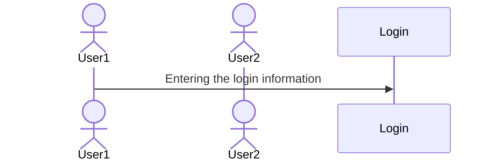

# CS 260 Notes

[My startup](https://simon.cs260.click)

## Helpful links

- [Course instruction](https://github.com/webprogramming260)
- [Canvas](https://byu.instructure.com)
- [MDN](https://developer.mozilla.org)

## Github Notes

Use 'git pull' to bring in new changes, 'git commit -am' to update all files with a message, and 'git push' to send back to the online version.

For help with Markdown: https://docs.github.com/en/get-started/writing-on-github/getting-started-with-writing-and-formatting-on-github/basic-writing-and-formatting-syntax

If I want to add a sequence diagram later:

-Endpoints in web programming is basically like the functions/methods of object-oriented programming. We make calls to servers/computers, to enable certain features or retrieve data

-Need to have something from the frontend calling to someone else's backend (that's the purpose of a third party service call)

## Development Notes

Good questions should 1) describe what the problem is, 2) what you're trying to do, and 3) what you've already done.
Good uses of AI would be to critique code, or to explain code that you then rewrite from scratch.
VIM is a ubiquitous console editor...it's the way we can change text-based data remotely, can use SSH to connect remotely with whatever servers we need. Can login with your DNS
VIM Commands: :q to quit, :q! to quit when you've made changes, i to enter insert mode, esc to go back to command mmode, and :w to write/serve

## AWS Notes

My public IP address is: http://98.82.152.63/
In creating an instance of a web server, it essentially means I now have my own computer sitting in a warehouse.
To remote shell (SSH) into my server, I just need the public IP address and address of production.pem, then put in the following: 
`ssh -i [key pair file] ubuntu@[ip address]`
Use `exit` to exit the remote shell

A domain name is just a text string listed in a special database (domain name registry) that are connected to IP addresses to make them more user-friendly. Route 53 is the AWS service that handles everything DNS-related: where we can buy a domain name, host the domain on their DNS servers, and create DNS records.

Caddy helps route HTTP requests, basically a service that listens and serves up the requested static files or routes it to another web service. Caddyfile is our configuration file containing definitions for routhing HTTP requests, usually don't have to modify. The public_html file is a directory of files that Caddy serves up when requests are made to the root or web server. 

## HTML Notes

Lorem ipsum dolor sit amet, consectetur adipiscing elit, sed do eiusmod tempor incididunt ut labore et dolore magna aliqua. Ut enim ad minim veniam, quis nostrud exercitation ullamco laboris nisi ut aliquip ex ea commodo consequat. Duis aute irure dolor in reprehenderit in voluptate velit esse cillum dolore eu fugiat nulla pariatur. Excepteur sint occaecat cupidatat non proident, sunt in culpa qui officia deserunt mollit anim id est laborum.
