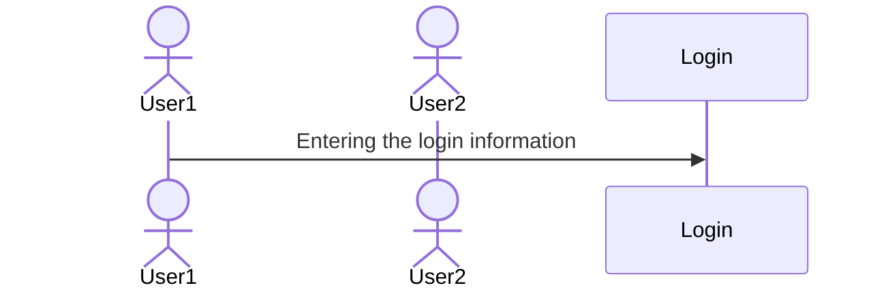

# CS 260 Notes

[My startup](https://simon.cs260.click)

## Helpful links

- [Course instruction](https://github.com/webprogramming260)
- [Canvas](https://byu.instructure.com)
- [MDN](https://developer.mozilla.org)

## Github Notes

Use 'git pull' to bring in new changes, 'git commit -am' to update all files with a message, and 'git push' to send back to the online version.

For help with Markdown: https://docs.github.com/en/get-started/writing-on-github/getting-started-with-writing-and-formatting-on-github/basic-writing-and-formatting-syntax

If I want to add a sequence diagram later:

- Endpoints in web programming is basically like the functions/methods of object-oriented programming. We make calls to servers/computers, to enable certain features or retrieve data

- Need to have something from the frontend calling to someone else's backend (that's the purpose of a third party service call)

## Development Notes

- Good questions should 1) describe what the problem is, 2) what you're trying to do, and 3) what you've already done.
- Good uses of AI would be to critique code, or to explain code that you then rewrite from scratch.
- VIM is a ubiquitous console editor...it's the way we can change text-based data remotely, can use SSH to connect remotely with whatever servers we need. Can login with your DNS
- VIM Commands: :q to quit, :q! to quit when you've made changes, i to enter insert mode, esc to go back to command mmode, and :w to write/serve
- `./deployFiles.sh -k <yourpemkey> -h <yourdomain> -s simon` to deploy on the terminal the new version of simon

## AWS Notes

- My public IP address is: http://98.82.152.63/
- In creating an instance of a web server, it essentially means I now have my own computer sitting in a warehouse.
- We use EC2 for the web server service, Route53 for the DNS service
- To remote shell (SSH) into my server, I just need the public IP address and address of production.pem, then put in the following: 
`ssh -i [key pair file] ubuntu@[ip address]`
- Use `exit` to exit the remote shell

A domain name is just a text string listed in a special database (domain name registry) that are connected to IP addresses to make them more user-friendly. Route 53 is the AWS service that handles everything DNS-related: where we can buy a domain name, host the domain on their DNS servers, and create DNS records.

Caddy helps route HTTP requests, basically a service that listens and serves up the requested static files or routes it to another web service. Caddyfile is our configuration file containing definitions for routhing HTTP requests, usually don't have to modify. The public_html file is a directory of files that Caddy serves up when requests are made to the root or web server. 

- Tech stack from high overview to low looks like: React -> Caddy2 -> NodeJS -> MongoDB (on the backend)
- NodeJS runs all the Javascript, it's the interpreter and will help run all the web services
- Frontend application: includes the browser, html/css, react
- Backend application: running on Node.js to work with server, database, etc
- Every device has a unique IP address, each connection point is a port. Certain ports like 443, is for secure HTTPS, and then once you get through you're just moved to another random port
- First layer in connections is Link layer (physical wire connections), then up is internet, like IP for establishing connections, third is transport, like TCP/UDP for packet delivery, last is application, like HTTPS for functionality like web browsing
- With the domain name, the root will include the suffix (.edu), or the TLD top level domain, along with the SLD secondary level domain (ex: tuneshare.click) which is bought together
- Subdomain comes before the root
- localhost is one domain that your computer will always know (127.0.0.1), hardcoded
- After creating a domain type, you can create DNS record types that will map certain names/domains to specific IP addresses

## HTML Notes

- We use tags to designate the start/end of an HTML element using (<> and </>)
- <!DOCTYPE html> should always go at the very beginning of the file
- HTML elemnt is top level structure, head comes next containing metadata and the <title> within. Body element will contain content structure, with <main> holding the bulk outside of headers, footers, etc
- Each element can have attributes that describe specific details of the element. Common example is the `id` attribute to distinguish it, or `class` to classify the element into a named group of elements. They're written inside the element tag with a name followed by an optional value. Ex:
- `
 id="hello" class="greeting">Hello world
`
- Hyperlinks are represented by an anchor element <a> with an attribute `href` containg the address of the link. Ex:
- `<a href="https://byu.edu">Go to the Y</a>`
- Comments can be made using <!-- commented text -->
- The main HTML file should usually be named index.html (default)
- Block elements are a distinct element in the flow of the content structure, while inline doesn't disrupt the flow of a block element's content
- Ex: `div` is a block element that could have an inline element `b` to bring attention to its subtext
- To insert an image, use `` etc
- Most input elements have some common attributes: `name` of the input, `disabled`, initial `value` of the input, `required` to signify if it has to be filled out to be valid
- To include an audio file you use `audio` element and use `src` to specify the URL. Include `controls` attribute if you want the user to be able to control the audio playback
- Document Object Model (DOM) is like the tree structure that specifies how HTML documents are rendered
- Might be a good idea to specify html document as `<html lang="en"></html>`

## CSS Notes

- A rule is comprised of a selector (selects elements to apply rule to) and 1+ declarations that represent the property to style with the given value
- Ex: p {color: green;} where p is the selector, color is the property, and green is the value. p would select all paragraph elements
- Can use the `style` attribute of an HTML element to explicitly assign declarations, or can add a style element in the `head` of the HTML document
- Alternatively, could use the HTML `link` element to create a hyperlink to an external file containing CSS rules (link must also be in the head element) (PREFERRED)
- `box_sizing: border-box` could be helpful for padding and border to be included in the size of a box
- Descendant combinators let us specify certain elements in relation to other elements that we want to modify
- If we have used the `class` attribute in our HTML elements, then we can add CSS attributes by `.classname {properties: values;}`
- IDs work in a similar way, but it targets a specific element, and use prefix #
- Pseudo-selectors are those linked to interactions, like links clicked, our mouse positions
- Use @font-face to provide a font name and source location (URL) to guarantee consistency
- Can also import Google fonts with `@import url('google fonts url')`
- To create CSS animations, we use `animation` properties and define `keyframes`, example:
- @keyframes demo {from{font-size: 0vh} to{font-size: 20vh} } to zoom in
- To debug CSS, you can right-click an element and selext `inspect`
- Can use the CSS `display` property to show element's children in a flexible or grid orientation, a block display (fills width of parent), or inline (has width as big as content)
- `<meta name="viewport" content="width=device-width,initial-scale=1" />` use this meta tag in all <head> elements so the browser doesn't scale the page
- 
